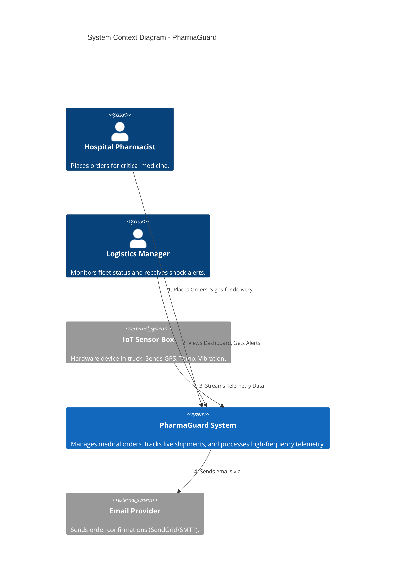
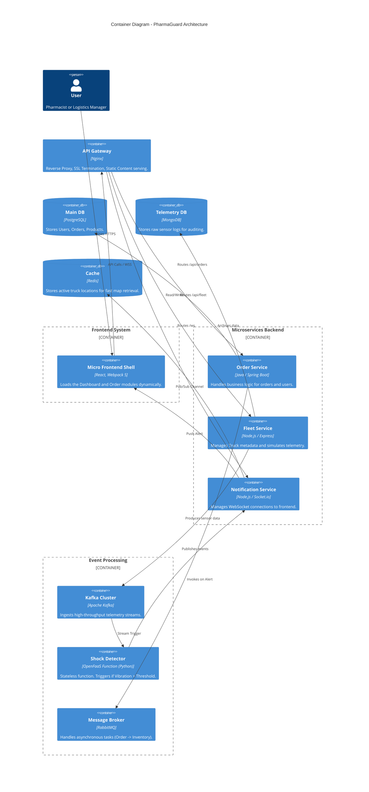
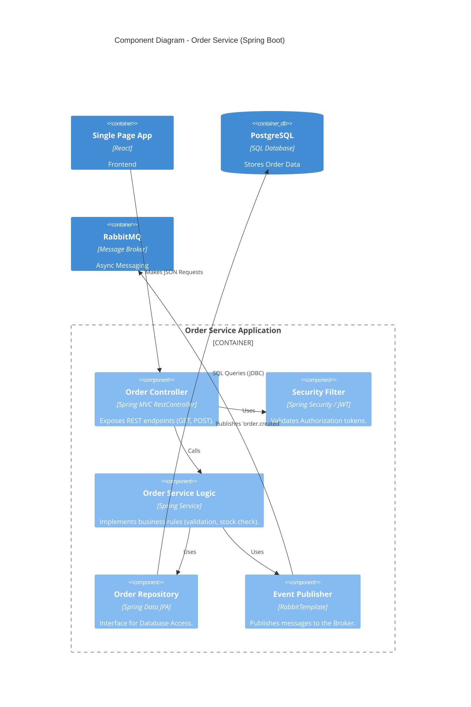
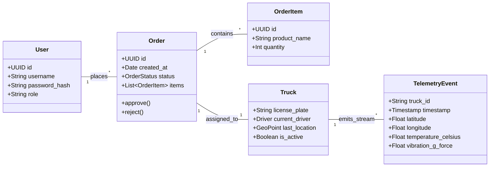

# PharmaGuard Architecture Documentation

## 1. System Context Diagram (Level 1)

This diagram defines the external actors and the system boundary.

## 2. Container Diagram (Level 2)

This diagram shows the microservices, data stores, and specific technologies (Kafka, Redis, FaaS).

## 3. Component Diagram: Order Service (Level 3)

Detailing the internal structure of the Spring Boot Order Service.

## 4. Data Model (UML Class Diagram)

Separation of Relational Data (Orders) and Time-Series Data (Telemetry).

