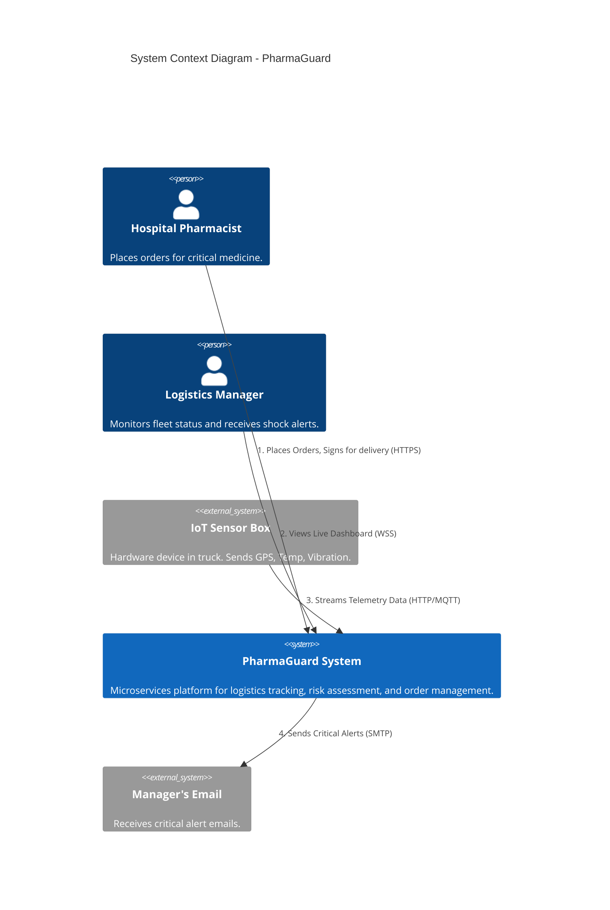
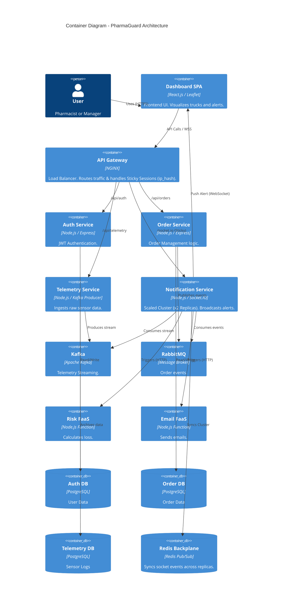
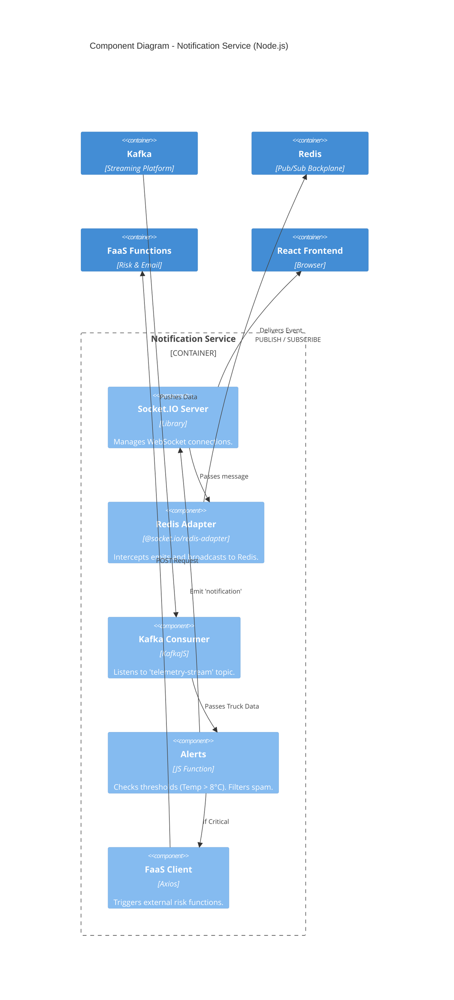
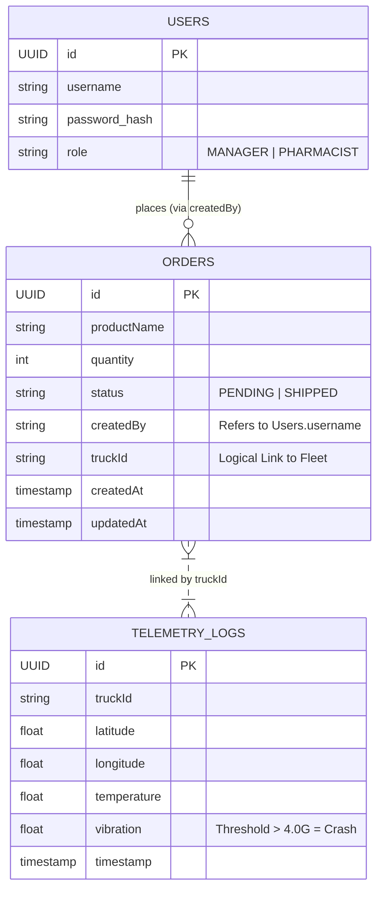

# PharmaGuard Architecture Documentation

## 1. System Context Diagram (Level 1)

## 2. Container Diagram (Level 2)

## 3. Component Diagram: Notification Service (Level 3)

## 4. Data Model (UML Class Diagram)

