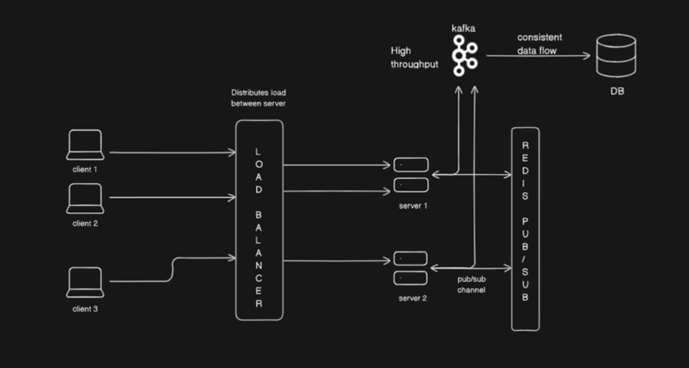
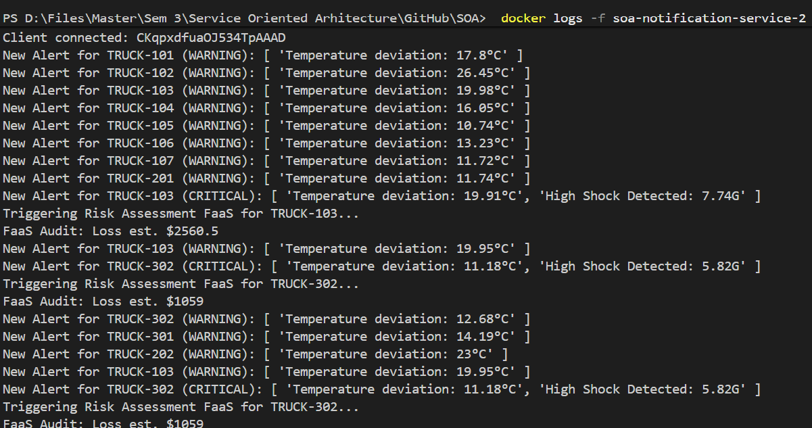
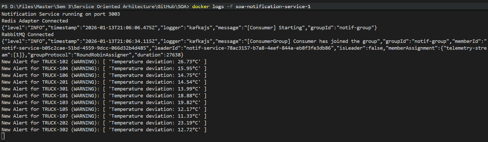
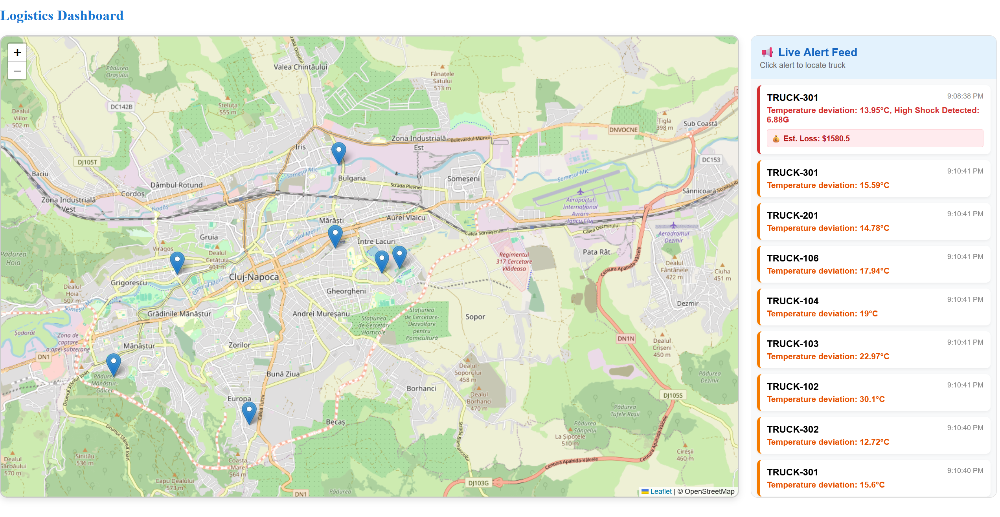

# Implementing Horizontal Scalability for Real-Time Notifications

## 1. Introduction

### 1.1. The Problem: The "Silo" Effect

Horizontal Scaling is the most used method of dealing with increased traffic load in a distributed system. While this architecture works great for stateless REST APIs, it breaks Real-Time WebSocket applications.

WebSockets create a persistent, stateful TCP connection between a client and a server instance.

-   Isolation: If a user connects to `Server Instance A`, their connection object exists only in the RAM of `Server Instance A`.
-   Failure Point: If `Server Instance B` detects a critical event, it has no access to the user connected to `Server A`.

This creates the "silo effect", where the servers act as isolated islands unable to communicate with each other. This is especially harmful in supply chain management and logistics industries, where coordination and real-time information are essential. For example, if a truck crashes and the alert is processed by a different server than the one the dispatch manager is connected to, the alert is lost, leading to critical delays and financial loss.

### 1.2. Why Redis and Socket.IO?

To solve this problem, we need a shared communication layer. We can implement this using a combination of Socket.IO and Redis.

**Socket.IO - Communication Protocol**

-   Is an abstraction library on top of WebSockets that enables real-time, bi-directional event communication between the browser and server.
-   Unlike raw WebSockets, Socket.IO provides built-in support for "Rooms" (grouping users) and automatic reconnection logic. It has a pre-built adapter interface designed specifically for horizontal scaling.

**Redis - Distributed Backplane**

-   Is an inmemory data structure store. For this use case, we use its Pub/Sub feature, not its caching feature.
-   Advantages of Redis Pub/Sub for Real-Time Alerts:
    -   Speed: Redis operates entirely in RAM, offering sub-millisecond latency. This is critical for real-time alerts where delays are unacceptable.
    -   Simplicity: The Pub/Sub model is "fire-and-forget". Unlike Kafka (which persists data), Redis instantly broadcasts messages to all listeners and discards them, which is the exact behavior needed for ephemeral UI notifications.
    -   Efficiency: Polling a traditional database (like Postgres) for new alerts would create massive I/O load. Redis pushes data instantly without polling.

### 1.3. Solution - The Redis Adapter Pattern

In the context of Socket.IO, the "Adapter" is the internal component responsible for broadcasting packets. By default, Socket.IO uses an In-Memory Adapter. It simply says: "Take this message and loop through the list of sockets stored in my local RAM." This works perfectly for a single server but fails in a distributed cluster because the "list of sockets" in RAM is incomplete (it only knows about local users).

The Redis Adapter (@socket.io/redis-adapter) is a specialized replacement for that default In-Memory Adapter:

-   Interception: When your code calls io.emit('alert', data), the Adapter intercepts this command.
-   Translation: Instead of just looking in local RAM, the Adapter translates the command into a Redis PUBLISH message.
-   Synchronization: The message travels to the Redis server, which broadcasts it to all other Notification Service instances subscribed to that channel.
-   Delivery: The Redis Adapters on those instances receive the message and trigger their own local broadcasts to their connected users.

This architecture decouples the Connection Layer (who is connected where) from the Application Logic (who needs to receive what), allowing the system to scale infinitely.

Let's take a look how this is inmplemented in our PharmaGuard system:


source: https://dev.to/raunakgurud09/websockets-unlocked-mastering-scale-of-websockets-3p54

a. Ingestion (Apache Kafka): Thousands of trucks stream GPS and sensor data into Kafka. This ensures reliable, high-volume data ingestion without overwhelming the database.
b. Processing (Notification Service): The Notification microservice consumes data from Kafka.
c. Distribution (Redis Pub/Sub): To visualize this data in real-time on the frontend, instead of sending them directly to the user (which fails in a distributed cluster), we passes them to the Redis Pub/Sub layer to be broadcast across all server instances.

## 2. Infrastructure Setup

We will use Docker to ensure our Redis instance is accessible by all microservices on the internal network.

**2.1: Define the Backplane**

Add the Redis (standard Alpine image) to your `docker-compose.yaml` like this:

```yaml
version: "3.8"
services:
    redis:
        image: redis:alpine
        container_name: shared_redis
        ports:
            - "6379:6379"
        restart: always
```

**2.2. The Load Balancer (NGINX)**

When running multiple backend instances, we need a single entry point for the frontend. We use NGINX as a Reverse Proxy.

We must enable Sticky Sessions (ip_hash) per https://socket.io/docs/v4/using-multiple-nodes/: Socket.IO connections begin with an HTTP Handshake before upgrading to a WebSocket. If the Load Balancer uses Round-Robin, the handshake request might go to `Server A` while the upgrade request goes to `Server B`, causing a "Session ID Unknown" error. ip_hash ensures a client stays connected to the same server for the duration of the session.

nginx.conf:

```nginx
upstream socket_cluster {
    ip_hash; # Ensures the handshake completes on the same server
    server notification-service:8080;
}

server {
    listen 80;
    location / {
    proxy_pass http://socket_cluster;
    proxy_set_header Upgrade $http_upgrade;
    proxy_set_header Connection "upgrade";
    proxy_http_version 1.1;}
}
```

**2.3. Connecting the Microservice**

Configure the microservice to depend on Redis:

```yaml
version: "3.8"
services:
    notification-service:
        build: ./packages/notification-service
        depends_on:
            - redis
        environment:
            - REDIS_HOST=redis
            - PORT=8080
```

## 3. Backend Implementation (Node.js with JavaScript)

We will inject a Redis Adapter into our Socket.IO server, which intercepts outgoing messages and routes them through the Redis backplane automatically.

**3.1. Install dependency**

First install the required libraries in your service folder:

```bash
npm install redis @socket.io/redis-adapter
```

**3.2. Configure the adapter**

Modify the server initialization to connect to Redis before accepting user connections:

```javascript
const { Server } = require("socket.io");
const { createClient } = require("redis");
const { createAdapter } = require("@socket.io/redis-adapter");

const io = new Server(server, { cors: { origin: "*" } });

// 1. Initialize Redis Clients
// We need two independent connections:
// 'pubClient' -> Used to publish messages
// 'subClient' -> Used to subscribe to messages
const pubClient = createClient({
    url: `redis://${process.env.REDIS_HOST}:6379`,
});
const subClient = pubClient.duplicate();

// 2. Connect and bind
Promise.all([pubClient.connect(), subClient.connect()])
    .then(() => {
        // 3. Inject the Adapter
        // This replaces the default in-memory store with the distributed Redis store.
        io.adapter(createAdapter(pubClient, subClient));
        console.log("Connected to Redis Pub/Sub");
    })
    .catch((err) => {
        console.error("Redis Connection Error:", err);
    });
```

By abstracting this logic into the adapter, the rest of the business logic (`io.emit('alert', data)` for ex.) remains unchanged.

## 4. Verify it works properly

In our standard development environment, we typically run a single instance of the Notification Service to save resources. However, because we implemented the Redis Adapter, our system is "Cloud-Ready". To verify this, we will temporarily scale our backend to 2 Replicas and demonstrate that they function as a unified cluster.

**4.1. Simulate a Cluster**
We use Docker Compose's scaling feature to spin up **2 replicas** of our service.

```bash
docker-compose up -d --build --scale notification-service=2
```

Docker launches `soa-notification-service-1` and `soa-notification-service-2`. Both connect to the single `shared_redis` container.

**4.2. Monitor**

Open two separate terminals to view the logs of each replica:

-   Terminal 1: `docker logs -f soa-notification-service-1`
-   Terminal 2: `docker logs -f soa-notification-service-2`

**4.3. Test**

1. Start PharmaGuard and open the Dashboard page. The Load Balancer routes the connection to Instance 1.

-   _Terminal 1:_ `Client connected: socket_id_A`



2. The Telemetry Service (data injector) pushes a Kafka message. Since Kafka balances consumer load, this message is picked up by Instance 2.

-   _Terminal 2:_ `Received Kafka Alert: { truckId: "TRUCK-101" }`



The logs demonstrate the Load Balancer routed the User (Frontend) to Service Replica 2, while the Kafka Consumer routed the Critical Alert for Truck-101 to Service Replica 1. Despite this separation, the user successfully received the alert. This proves the Redis Pub/Sub Backplane successfully bridged the gap, allowing Replica 1 to broadcast the event to the user connected on Replica 2.

**4.4. Result**

Even though the data arrived at Instance 2 (Terminal 2), the Red Alert banner appears immediately on the Dashboard (connected to Instance 1).

This confirms that Instance 2 successfully published the event to Redis, and Instance 1 successfully retrieved it and delivered it to the user.



## 5. Conclusion

By integrating Redis Pub/Sub, we have successfully decoupled the connection from the application logic. The PharmaGuard system can scale horizontally to hundreds of instances to support massive fleets of trucks, ensuring high availability and fault tolerance without sacrificing real-time responsiveness.
